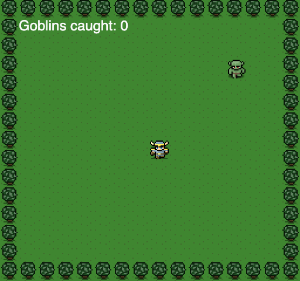

# HTML5 Canvas game

Tutorial can be found [here](http://www.lostdecadegames.com/how-to-make-a-simple-html5-canvas-game/)

Functions as should, however keyCode is deprecated - might be worth using keyboardEvent.code instead
